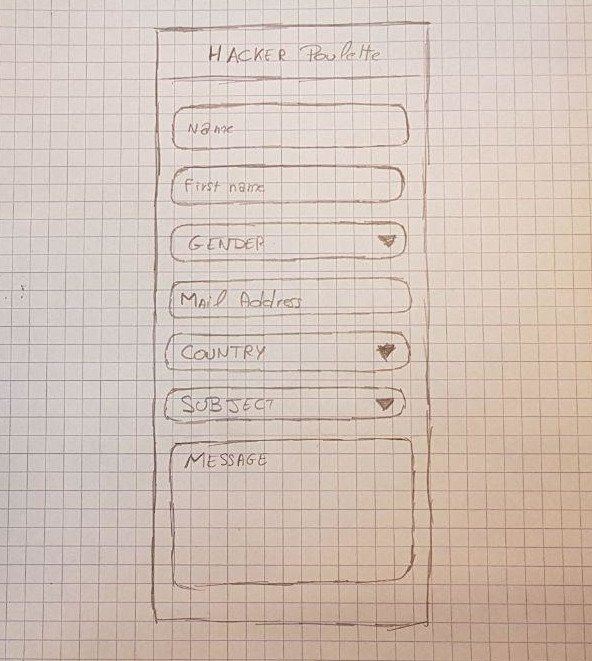
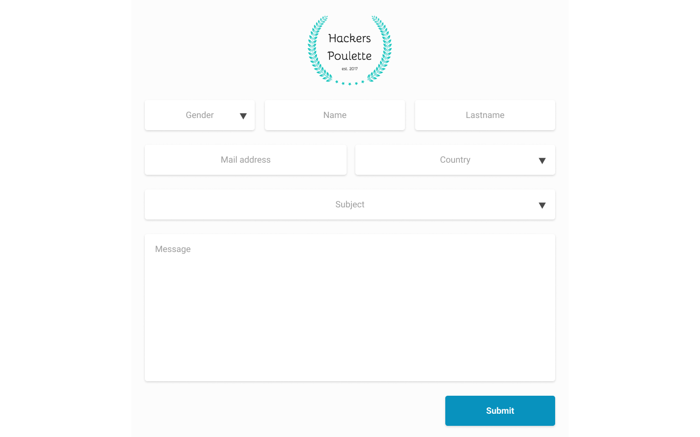

# Hackers Poulette
A project about form, PHP, security and mailing.

## See the Project
You can access the project [here](http://nassimkoceir.be/poulette/).

## What is all about ?
We had to create a small PHP application that sanitize and validate all the form input then it sends an e-mail.  

## When did you work on this project ?
We had 3 days to work on this, from 9 to 11 october.

## Where did you work on this project ?
We were at Becode Brussels.

## Materials

